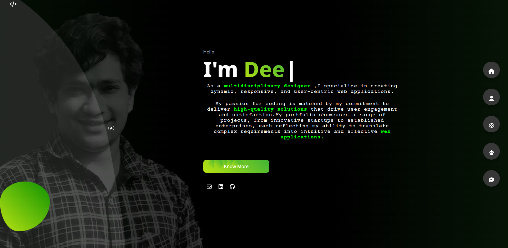
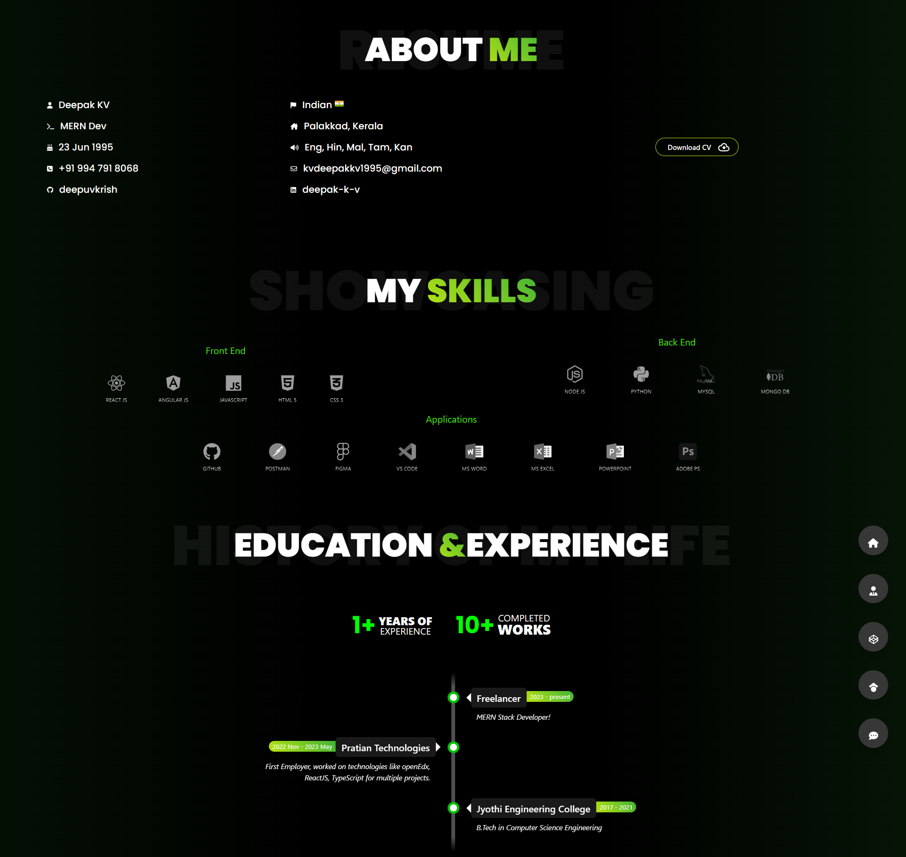
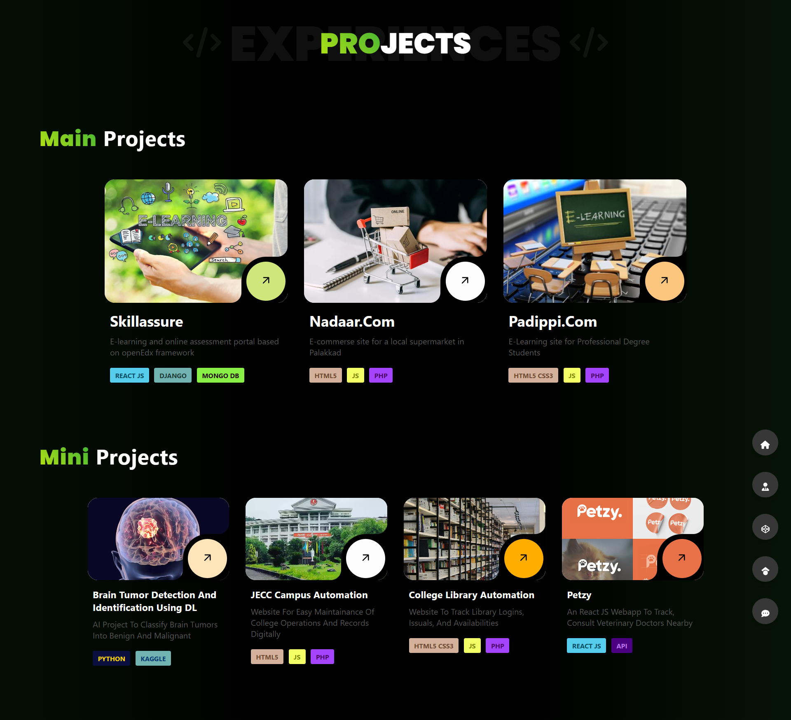

# Welcome to my Portfolio

This project was bootstrapped with [Create React App](https://github.com/facebook/create-react-app).

## Used Tech Stacks:

### `React JS` `HTML5` `CSS3`

## To Run in Local-

Clone this repository [git clone command](https://github.com/deepuvkrish/portfolio-latest.git).

CD into the cloned directory

### `npm install` Install necessary dependencies using npm commands

### `npm start` To run locally

## Portfolio

## About Me

## Projects

